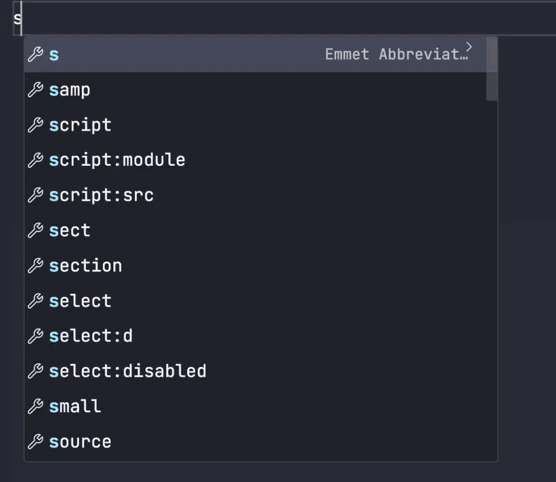

# Svelte 5 Snippets

This extension is a set of Snippets for Svelte. They are created so that scaffolding with Svelte can be easy. You can try to remember most of these but. Before reading the full snippets down below. The snippets are made so that you write your HTML before writing your scripts and styles.



## Snippets Documentation

| Prefix | Description         |
| ------ | ------------------- |
| `sv`   | Svelte Snippets     |
| `sk`   | Svelte-Kit Snippets |

## Svelte

<details>
<summary>sv:base</summary>

```html
<script lang="ts">

</script>

<div>

</div>

<style>

</style>
```

</details>

<details>
<summary>sv:base-component</summary>

```html
<script lang="ts">
import type { Snippet } from 'svelte';

let { children }:{ children:Snippet } = $props();

</script>

<div>
  {@render children()}
</div>

<style>

</style>
```

</details>

<details>
<summary>sv:script</summary>

```html
<script lang="ts">

</script>
```

</details>

<details>
<summary>sv:css</summary>

```html
<style>

</style>
```

</details>

<details>
<summary>sv:css-lang</summary>

```html
<style lang="">

</style>
```

</details>

<details>
<summary>sv:if</summary>

```html
{#if }

{/if}
```

</details>

<details>
<summary>sv:if-else</summary>

```html
{#if }

{:else}

{/if}
```

</details>

<details>
<summary>sv:if-else-if</summary>

```
{#if }

{:else if }

{/if}
```

</details>

<details>
<summary>sv:each</summary>

```
{#each items as item}

{/each}
```

</details>

<details>
<summary>sv:each-else</summary>

```
{#each items as item}

{:else}

{/each}
```

</details>

<details>
<summary>sv:each-index</summary>

```
{#each items as item, i}

{/each}
```

</details>

<details>
<summary>sv:each-index-key</summary>

```
{#each items as item, i (item.id)}

{/each}
```

</details>

<details>
<summary>sv:await</summary>

```
{#await promise}

{:then value}

{:catch error}

{/await}
```

</details>

<details>
<summary>sv:debug</summary>

```
{@debug }
```

</details>

<details>
<summary>sv:html</summary>

```
{@html }
```

</details>

<details>
<summary>sv:snippet</summary>

```
{#snippet fc(value)}

{/snippet}
```

</details>

<details>
<summary>sv:slot</summary>

```
<slot></slot>
```

</details>

<details>
<summary>sv:slot-name</summary>

```
<slot name=""></slot>
```

</details>

<details>
<summary>sv:render</summary>

```
{@render }
```

</details>

<details>
<summary>sv:render-fallback</summary>

```
{#if children}
	{@render children()}
{:else}
	<span>default</span>
{/if}
```

</details>

<details>
<summary>sv:bind-value</summary>

```
bind:value={}
```

</details>

<details>
<summary>sv:bind-this</summary>

```
bind:this={}
```

</details>

<details>
<summary>sv:transition-fade</summary>

```
transition:fade="{{delay: 250, duration: 300}}"
```

</details>

<details>
<summary>sv:transition-blur</summary>

```
transition:blur="{{amount: 10}}"
```

</details>

<details>
<summary>sv:transition-fly</summary>

```
transition:fly="{{delay: 250, duration: 300, x: 100, y: 500, opacity: 0.5, easing: quintOut}}"
```

</details>

<details>
<summary>sv:transition-slide</summary>

```
transition:slide="{{delay: 250, duration: 300, easing: quintOut }}"
```

</details>

<details>
<summary>sv:transition-scale</summary>

```
transition:scale="{{duration: 500, delay: 500, opacity: 0.5, start: 0.5, easing: quintOut}}"
```

</details>

<details>
<summary>sv:transition-draw</summary>

```
transition:draw="{{duration: 5000, delay: 500, easing: quintOut}}"
```

</details>

<details>
<summary>sv:animate-flip</summary>

```
animate:flip="{{delay: 250, duration: 250}}"
```

</details>

<details>
<summary>sv:self</summary>

```
<sv:self></sv:self>
```

</details>

<details>
<summary>sv:options</summary>

```
<svelte:options />
```

</details>

<details>
<summary>sv:window</summary>

```
<svelte:window  />
```

</details>

<details>
<summary>sv:head</summary>

```
<svelte:head>

</svelte:head>
```

</details>

<details>
<summary>sv:body</summary>

```
<svelte:body  />
```

</details>

## Svelte Kit

<details>
<summary>sk:page</summary>

```html
<script lang="ts">
	import type { PageData } from './$types';

	export let data: PageData;

</script>
```

</details>

<details>
<summary>sk:page-load</summary>

```ts
import type { PageLoad } from "./$types";

export const load: PageLoad = async (event) => {
  return {};
};
```

</details>

<details>
<summary>sk:page-server-load</summary>

```ts
import type { PageServerLoad } from "./$types";

export const load: PageServerLoad = async (event) => {
  return {};
};
```

</details>

<details>
<summary>sk:layout-load</summary>

```ts
import type { LayoutLoad } from "./$types";

export const load: LayoutLoad = async (event) => {
  return {};
};
```

</details>

<details>
<summary>sk:layout-server-load</summary>

```ts
import type { LayoutServerLoad } from "./$types";

export const load: LayoutServerLoad = async (event) => {
  return {};
};
```

</details>

<details>
<summary>sk:actions</summary>

```ts
import { Actions } from './$types';

export const actions: Actions = {
	 async default({  }) {

	 }
};
```

</details>

<details>
<summary>sk:handle</summary>

```ts
import type { Handle } from "./$types";

export const handle: Handle = async ({ event, resolve }) => {
  const response = await resolve(event);
  return response;
};
```

</details>

<details>
<summary>sk:error</summary>

```ts
error(404, {
	message:"Not found"
});
```

</details>

## TypeScript / JavaScript

<details>
<summary>sv:state</summary>

```ts
let state = $state();
```

</details>

<details>
<summary>sv:state-frozen</summary>

```ts
let state = $state.frozen();
```

</details>

<details>
<summary>sv:state-snapshot</summary>

```ts
$state.snapshot();
```

</details>

<details>
<summary>sv:state-is</summary>

```ts
$state.is(, )
```

</details>

<details>
<summary>sv:derived</summary>

```ts
let value = $derived();
```

</details>

<details>
<summary>sv:derived-by</summary>

```ts
let value = $derived.by(() => {});
```

</details>

<details>
<summary>sv:effect</summary>

```ts
$effect(() => {});
```

</details>

<details>
<summary>sv:effect-pre</summary>

```ts
$effect.pre(() => {});
```

</details>

<details>
<summary>sv:effect-root</summary>

```ts
const cleanup = $effect.root(() => {
  $effect(() => {});

  return () => {};
});
```

</details>

<details>
<summary>sv:props</summary>

```ts
let {} = $props();
```

</details>

<details>
<summary>sv:host</summary>

```ts
$host().dispatchEvent();
```

</details>

<details>
<summary>sv:flush-sync</summary>

```ts
flushSync(() => {});
```

</details>

<details>
<summary>sv:hook</summary>

```ts
export function useCounter() {
  let count = $state(0);

  function increment() {
    count += 1;
  }

  return {
    get count() {
      return count;
    },
    increment,
  };
}
```

</details>

<details>
<summary>sv:store</summary>

```ts
import { writable } from "svelte/store";

export function createCounter() {
  const { subscribe, update } = writable(0);

  function increment() {
    update((count) => count + 1);
  }

  return {
    subscribe,
    increment,
  };
}
```

</details>

<details>
<summary>sv:set-context</summary>

```ts
setContext("");
```

</details>

<details>
<summary>sv:get-context</summary>

```ts
const context = getContext();
```

</details>

## Css

<details>
<summary>sv:global-css</summary>

```css
:global() {

}
```

</details>

## License

[MIT](license)
